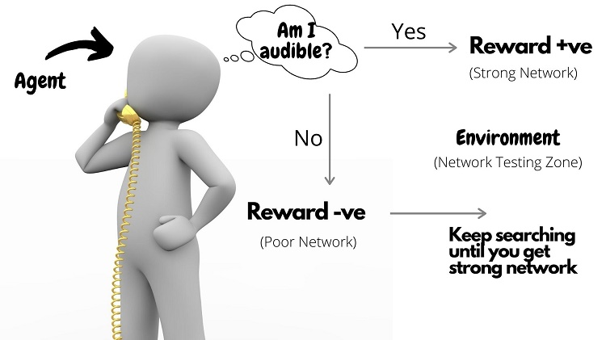

# Deep Q-Learning

## A Minimal Deep Q-Network

Running this code will render the agent solving the CartPole environment using OpenAI gym. Our Minimal Deep Q-Network is approximately 150 lines of
code. In addition, this implementation uses Tensorflow and Keras and should generally run in less than 15 minutes.

### Usage

```shell
python3 main.py
```

## Terminology

### Reinforcement Learning (RL)

It can be defined as the study of taking optimal decisions utilizing experiences. It is mainly intended to solve a specific kind of problem where the
decision-making is successive and the goal or objective is long-term, this includes robotics, game playing, or even logistics and resource management.

### Difference of RL from other ML algorithm

The ultimate goal of RL is not to be greedy all the time by looking for quick immediate rewards, rather optimize for maximum rewards over the complete
training process.

### Q-Learning

<b>Agent</b>: The agent in RL can be defined as the entity which acts as a learner and decision-maker. It is empowered to interact continually, select
its own actions, and respond to those actions.

<b>Environment</b>: It is the abstract world through which the agent moves. The Environment takes the current state and action of the agent as input
and returns its next state and appropriate reward as the output.

<b>States</b>: The specific place at which an agent is present is called a state. This can either be the current situation of the agent in the
environment or any of the future situations.

<b>Actions</b>: This defines the set of all possible moves an agent can make within an environment.

<b>Reward or Penalty</b>: This is nothing but the feedback by means of which the success or failure of an agent’s action within a given state can be
measured. The rewards are used for the effective evaluation of an agent’s action.

<b>Policy or Strategy</b>: It is mainly used to map the states along with their actions. The agent is said to use a strategy to determine the next
best action based on its current state.


